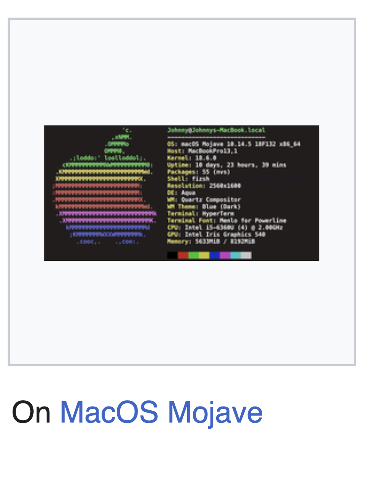

# s9-quant
A Blisteringly Simple Terminal based Playground of Raw Quant Mental Math Exercises

### Features
- Intelligently scrapes the web for new questions and news
- GPT wrapper for dynamic q/a's
- ASCII data visualisations
- Regex for input command identification
- Basic machine learning algorithms applied to user performance data
- Generative techniques to formulate questions sets
- [Recusrive 24 Algorithm](https://w3.cs.jmu.edu/spragunr/CS159/pas/twenty_four/twenty_four.shtml)

# TO-DO
- Every question you complete gives you a QXP, with multipliers for streaks etc. 
- It needs a... Scraper. 
- 'QXP earned: ' 
- Database
- :-( :-| :-) 𝝈 - whil eyou're playing. The sigma is multicoloured
- Main loop
- approximation game
-# ranking mode
- need a json list of q's and a's under certain categories.
- Add a timer showing how long each one takes 
- Make it ‘grindable
- Badges custom name thin about the mechanics 

- Simple, more simple. 
- full trading sim - make it addictibe, like gamvling. 
- ℞ +/0
- puts you in the top % of people (quantile)
- what makes speed typing test good... it's simple. you get good scores. 
- Use it to practice like call’s puts

- Every question you complete gives you a QXP, with multipliers for streaks etc. 
- It needs a... Scraper. 
- 'QXP earned: ' 
- :-( :-| :-) 𝝈 - whil eyou're playing. The sigma is multicoloured
- Main loop
- approximation game
- ranking mode
- need a json list of q's and a's under certain categories. 

- Colour of sigma, rank
- Personality type: 
- Cookie clicker addictive
- Stats: percentile of people, games played,
- why mntl math?

Solving algorithm: 
- number of combinations (all 4 numbers must be used once, any of the 4 operations any number of times)
- ⇒ $4! *  4^3$

[Curses Python](https://docs.python.org/3/library/curses.html)

