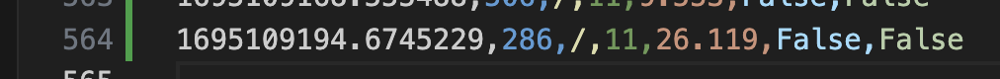

# s9-quant
`quant-cat?`
*A Blisteringly Simple Terminal based Playground of Raw Quant Mental Math Exercises*

---

---

### Features
- Intelligently scrapes the web for new questions and news
- GPT wrapper for dynamic q/a's
- ASCII data visualisations
- Regex for input command identification
- Basic machine learning algorithms applied to user performance data
- Generative techniques to formulate questions sets
- [Recusrive 24 Algorithm](https://w3.cs.jmu.edu/spragunr/CS159/pas/twenty_four/twenty_four.shtml)

### TO-DO
- [ ] WPM
- [ ] Username, password, and leaderboard
- [ ] Add Cat
- [ ] Every question you complete gives you a QXP, with multipliers for streaks etc. 
- [ ] It needs a... Scraper.
- [ ] Might need to borrow pdf parser
- [ ] 'QXP earned: ' 
- [ ] Database
- [ ] :-( :-| :-) 𝝈 - whil eyou're playing. The sigma is multicoloured
- [ ] Main loop
- [ ] approximation game
- [ ] ranking mode
- [ ] need a json list of q's and a's under certain categories.
- [ ] Add a timer showing how long each one takes 
- [ ] Make it ‘grindable
- [ ] Badges custom name thin about the mechanics 

- [ ] Simple, more simple. 
- [ ] full trading sim - make it addictibe, like gamvling. 
- [ ] ℞ +/0
- [ ] puts you in the top % of people (quantile)
- [ ] what makes speed typing test good... it's simple. you get good scores. 
- [ ] Use it to practice like call’s puts

- [ ] Every question you complete gives you a QXP, with multipliers for streaks etc. 
- [ ] It needs a... Scraper. 
- [ ] 'QXP earned: ' 
- [ ] :-( :-| :-) 𝝈 - whil eyou're playing. The sigma is multicoloured
- [ ] Main loop
- [ ] approximation game
- [ ] ranking mode
- [ ] need a json list of q's and a's under certain categories. 

- [ ] Colour of sigma, rank
- [ ] Personality type: 
- [ ] Cookie clicker addictive
- [ ] Stats: percentile of people, games played,
- [ ] why mntl math?
- [ ] GUESSTIMATES - use GPT to generate the context. Estimate e.g market is "170 million and our sales are 30 million, what is our market share"

Solving algorithm: 
- [ ] number of combinations (all 4 numbers must be used once, any of the 4 operations any number of times)
- [ ] ⇒ $4! *  4^3$

[Curses Python](https://docs.python.org/3/library/curses.html)

---

# ZetaMatrix - Zetamac but intelligent (a distracted side project)
*Literally since year 4, when I first starting doing competitive times tables, I've wanted to know what the hardest ones were and why*  
*Redefining the times tables with data science*
- [ ] make the matrix bigger, 1-15 multiplication
- [ ] 120 seconds 
- [ ] number of wrong attempts
- [ ] ? / 10,000 contributed 
- [ ] Theme()
- [ ] numpad practice
- [ ] backspace
- [ ] sessions, 120s. 
- [ ] Invert the colourmap and change colours
- [ ] Can compute your E[X] and Var[X] as in; your average speed, and how consistent you are, from the data
- [ ] This is computed from a window of maybe 250 most recent answers?^ 
- [ ] As well as % of questions answered  
- [ ] Time taken is right skewed so I could take the log
- [ ] I have my full learning curve rn, so sick. 
- [ ] Collect more data 
- [x] Different multiply sign
- [ ] Tally key presses and how quickly the numbers are typed in... interesting, could do some correaltion
- [ ] Add the cat
- [ ] Change the home and game screen, maybe a much smaller zetamatrix, like a 1:5 type thing, cycle through them.
- [ ] Add more space
- [ ] Calculate E(V) and E(X) 
- [ ] Compute top 5 fastest time ever, and the question it was for
- [ ] Infer weakness (e.g multiplying 2 digit numbers)
- [ ] Thinking time statistic
- [ ] It would take 10,000 * 5 seconds (e(v)) to fill out addition alone. Thus, I am calling to. 
Using statistics, 99% can be filled with just 10 users 
- [ ] Guesstimates 
- [ ] A lightbulb for tips like 32 * 28
- [ ] Average by sessions
- [ ] Induced learning curve; if it took x2 longer than the users E[S], then start to drill it, and plot the learning curve for a single question combination 
- [ ] Timed column - indicating if the user started a 120s timed blitz. 
- [ ] Track typing speed - how. 

### Things I expect to see from the ZetaMatrix Data
- (when I realised I was truly grateful that I found data science as my craft - the dotplot)
- The 10's column should have very quick times
- Learning curves
- Variance as well as mean, slimming. 
- It will be the most interesting once the user sees the same question (5+2), because then we have a controlled experiment. Looking at learning curves over individual questions
- Rate of 'mistakes' (which could be poisson), should gradually decline. 
- As the num1/num2 get larger, the circles shouldget darker indicating more thinking time
- Factors: - ??? - study: get to 100 as fast as possible or do as many in 2 mins. And some others factor. 5 min session threshold. Factors are typing speed. Could you pick out the moment I realised the / 11 trick. 12’s are hard. 

### Data Inference ideas 
`1, 2, 4, and 8 primarily` 

- Typing speed
- Can engineer 'sessions' (data points are part of the same session if they occur within 2 minutes of each other)
- This is another feature 
- See the moment I learnt the /11 trick
- Even though everyone is on a spectrum, from me to Terry (cracked fast) we want to see if their RELATIVE speeds are the same; i.e no matter the general speed, does everyone find take twice as long to do ? x 12 

1. **Rate of Improvement**: By tracking a user's performance over time, you can visualize their learning curve. Some users might show rapid initial improvement followed by a plateau, while others might demonstrate steady incremental improvement. This could reflect different learning styles and strategies.

2. **Problem Areas**: If a user consistently struggles with a specific number combination or operation (e.g., multiplying by 8), you could infer that this is a challenging area for them. This could be used to offer targeted practice or exercises.

3. **Time of Day Analysis**: By timestamping each answer, you can analyze performance variations based on the time of day. For example, are users typically faster in the morning, afternoon, or evening? This could provide insights into optimal brain performance times.

4. **Effects of Practice**: If a user consistently plays the game daily vs. someone who plays sporadically, do they show different improvement rates? This could underscore the importance of regular practice in skill acquisition.

5. **Stamina and Focus**: How does performance degrade over a single session? If a user plays for an extended period, do they get slower, indicating mental fatigue?

6. **Comparative Analysis**: Based on demographics or self-reported data (like age, educational background, etc.), you can compare different groups' performances. Do users with a college degree in mathematics perform better than those without? How does performance vary by age groups?

7. **Consistency**: Some users might have widely varying times, indicating they might be easily distracted or have inconsistent focus. Others might be very consistent, indicating strong concentration.

8. **Response to Mistakes**: If you track incorrect answers, you can analyze how users respond post-mistake. Do they tend to slow down, indicating caution? Or do they speed up, possibly in frustration or eagerness to move past the error?

9. **Adaptive Difficulty**: If your game adjusts in difficulty based on performance, you can analyze how quickly users adapt to more challenging questions. This could provide insights into their adaptability and resilience.

#### Moment when James X taught me / 11:
