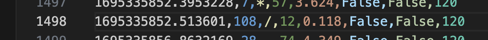

# s9-quant
`quant-cat?`
*A Blisteringly Simple Terminal based Playground of Raw Quant Mental Math Exercises*

---


---

### Features
- Intelligently scrapes the web for new questions and news
- GPT wrapper for dynamic q/a's
- ASCII data visualisations
- Regex for input command identification
- Basic machine learning algorithms applied to user performance data
- Generative techniques to formulate questions sets
- [Recusrive 24 Algorithm](https://w3.cs.jmu.edu/spragunr/CS159/pas/twenty_four/twenty_four.shtml)

### TO-DO
- [ ] Zetamac; generate all solutions for 24
- [ ] TEZ. 
- [ ] EYE TRACKING ON OCT 10 2023
- [ ] Reaction time
- [ ] Date of Birth Tester (how old is...)
- [ ] PATTERNS
- [ ] WPM<->
- [ ] Username, password, and leaderboard
- [ ] Add Cat
- [ ] Every question you complete gives you a QXP, with multipliers for streaks etc. 
- [ ] It needs a... Scraper.
- [ ] Might need to borrow pdf parser
- [ ] 'QXP earned: ' 
- [ ] Database
- [ ] :-( :-| :-) 𝝈 - whil eyou're playing. The sigma is multicoloured
- [ ] Main loop
- [ ] approximation game
- [ ] ranking mode
- [ ] need a json list of q's and a's under certain categories.
- [ ] Add a timer showing how long each one takes 
- [ ] Make it ‘grindable
- [ ] Badges custom name thin about the mechanics 

- [ ] Simple, more simple. 
- [ ] full trading sim - make it addictibe, like gamvling. 
- [ ] ℞ +/0
- [ ] puts you in the top % of people (quantile)
- [ ] what makes speed typing test good... it's simple. you get good scores. 
- [ ] Use it to practice like call’s puts

- [ ] Every question you complete gives you a QXP, with multipliers for streaks etc. 
- [ ] It needs a... Scraper. 
- [ ] 'QXP earned: ' 
- [ ] :-( :-| :-) 𝝈 - whil eyou're playing. The sigma is multicoloured
- [ ] Main loop
- [ ] approximation game
- [ ] ranking mode
- [ ] need a json list of q's and a's under certain categories. 

- [ ] Colour of sigma, rank
- [ ] Personality type: 
- [ ] Cookie clicker addictive
- [ ] Stats: percentile of people, games played,
- [ ] why mntl math?
- [ ] GUESSTIMATES - use GPT to generate the context. Estimate e.g market is "170 million and our sales are 30 million, what is our market share"

Solving algorithm: 
- [ ] number of combinations (all 4 numbers must be used once, any of the 4 operations any number of times)
- [ ] ⇒ $4! *  4^3$

[Curses Python](https://docs.python.org/3/library/curses.html)

---

# ZetaMatrix - Zetamac but intelligent (a distracted side project)
*Literally since year 4, when I first starting doing competitive times tables, I've wanted to know what the hardest ones were and why* <br>
*Also: how variable is a given zetamac* 
*Also: What makes quant traders faster (high frequency time series analysis on keystrokes)*
*Redefining the times tables with data science*
*Data driven zetamac*


### The Schema 
- Recieve points if you're the first person to contribute a certain combination i.e 5*24
- Sponsored by Optiver 
- And then just a very very simple: Zetamac leaderboard. 
`Play 150s` `Leaderboard` `Touch Typing Dojo` 

- [ ] Blisteringly simple leaderboard w/ Username and best score 
- [ ] A live Zetamarix and then bottom left Live ASCII window 
- [ ] Go crazy w/ touch typing dojo, have a full TUI like speedometer 
- [ ] make the matrix bigger, 1-15 multiplication
- [ ] A live replay after you finish your game. x5 speed. 
- [ ] 120 seconds 
- [ ] My practice rates 
- [ ] Uhm: That's a good idea, your zeta profile, how can I mke a profile gyatttttttttt
- [ ] number of wrong attempts
- [ ] Asterickes explaining E[S], Var[S], Finesse, 
- [ ] zetamatrix data driven
- [ ] Leaderboard 
- [ ] ? / 10,000 contributed 
- [ ] Theme()
- [ ] numpad practice
- [ ] backspace
- [ ] sessions, 120s. 
- [ ] Invert the colourmap and change colours
- [ ] Can compute your E[X] and Var[X] as in; your average speed, and how consistent you are, from the data
- [ ] This is computed from a window of maybe 250 most recent answers?^ 
- [ ] As well as % of questions answered  
- [ ] Time taken is right skewed so I could take the log
- [ ] I have my full learning curve rn, so sick. 
- [ ] Collect more data 
- [x] Different multiply sign
- [ ] Tally key presses and how quickly the numbers are typed in... interesting, could do some correaltion
- [ ] Add the cat
- [ ] Race against
- [ ] Change the home and game screen, maybe a much smaller zetamatrix, like a 1:5 type thing, cycle through them.
- [ ] Add more space
- [ ] A close button
- [ ] Better summary statistics after each game: 3 fastest, 3 slowest, delta (is this better or slower than your usual) Will require parsing. 
- [x] fix space bar
- [ ] Generate the 12x100 times tables 
- [ ] Calculate E(V) and E(X) 
- [ ] Compute top 5 fastest time ever, and the question it was for
- [ ] Infer weakness (e.g multiplying 2 digit numbers)
- [ ] Thinking time statistic
- [ ] It would take 10,000 * 5 seconds (e(v)) to fill out addition alone. Thus, I am calling to. 
Using statistics, 99% can be filled with just 10 users 
- [ ] Guesstimates 
- [ ] A lightbulb for tips like 32 * 28
- [ ] Average by sessions
- [ ] Induced learning curve; if it took x2 longer than the users E[S], then start to drill it, and plot the learning curve for a single question combination 
- [ ] Timed column - indicating if the user started a 120s timed blitz. 
- [ ] Change scatterplot dimensions and do black plots 
- [ ] Track typing speed - how. 
- [ ] Show your delta speed change. 
- [ ] Loading brain matrix TUI type shit. 
- [ ] It needs ONE smart addictive factor, so that the game gets popular and i get more data. 
- [ ] Add WPM thing
- [ ] Infer reaction time. 
- [ ] Add current csv being read to
- [ ] 'SAved' icon
- [ ] Need to see the stats figure out where you go wrong - dividing by 11’s… type thing.
- [ ] Variance explained by… 
- [ ] A chill practice mode and a 5 minute mode and a rnanked mode. 
- [ ] Send it live
- [ ] Actual like dojo training mode, which: 
  - Goes through all your slowest times (x4 above your average) and makes you do them until you get them 3 times in a row, back within normal range. Also uses GPT to break down how to approach? idk
- [ ] 'View times table' 
- [ ] https://www.asciiart.eu/art-and-design/patterns
- [ ] 'How quickly can you fill up this grid' so it's like how quickly can you get to 100 (inverse) 
  - Maybe like some stickman-esque shit. 
  - simple mathletics game
- probability of seeing the same question twice in a score 50 game 
- Build the typing trainer 
- Touch typing dojo


### Things I expect to see from the ZetaMatrix Data
- (when I realised I was truly grateful that I found data science as my craft - the dotplot)
- The 10's column should have very quick times
- See the outline around the normal times tables, up to 12 (as they're taught) and expect a big drop off beyond it. 
- Learning curves
- Variance as well as mean, slimming. 
- It will be the most interesting once the user sees the same question (5+2), because then we have a controlled experiment. Looking at learning curves over individual questions
- Rate of 'mistakes' (which could be poisson), should gradually decline. 
- As the num1/num2 get larger, the circles shouldget darker indicating more thinking time
- Factors: - ??? - study: get to 100 as fast as possible or do as many in 2 mins. And some others factor. 5 min session threshold. Factors are typing speed. Could you pick out the moment I realised the / 11 trick. 12’s are hard. 
- PRAYING for something poisson (rewatch the 'umh' video)
- What's crazy is that there's 2 * 99 * 99 + 2 * 12 + 99 different possible combinations. one person will never get through all of them. Uniformly distributed across those 4... kinda. not really. using probability what is the E(X) of like times you'll repeat a question. or E(X) of questions you'll cover. 20,000... so it'd take 
- [ ] Must track like keystroke speed: 0.050$0.32$
- [ ] Typing Speed
- [ ] A display of the 1-9 blocks in a row or in numpad, to visualise. 
- [ ] Negative for backspace as o 3 oct 
footage x2


### STATISTICALLY 
- Statistically, I must get a hard one soon - quantify that
- Statistically, how much is your score just hte variance
- Statically, when do you see the same questions you’ve done before
- Statically; how much are you limited by your WPM
- progression once a game has started. 
- how to classify time series data... 
  - predictrs whos playing
  - poisson? 
  - live prediction of who's playing 
  - Zetamac sexy distribution of times, distribution of keystrokes 


User attributes to collect
- How many times have you practiced this? 
- Age
- Current/upcoming work type 


### Test Subjects 
Testing a diverse spectrum of subjects; including talent from IMC, Optiver, Canva and Citadel
- Terrence - IMC
- Patrick - Optiv
- Molly - ?
- Kyla - Atlassian
- William - Macqua
- Shang Li - Jane St

- Affinda people
- James
- William (macquarie)
- Molly (gimlet)
- Will H. (swaglord)
- Sai (canva)
- Amanda
- Kyla (atlassian)
- Alex 

- I lowkey need to do:
  - Every professor at university and make a map. All I theoretically need is 2x2 mins of data. The first one is always a good warmup. Also then, I have data on their first and second session. 


I love seeing any mental math in the range cos like I know that my program will eventualy generate it. 


- why is 10's the slowest? its not dumbass


# Data Inference ideas 

### Questions answered in this study

**The math**
- In paper - beginning, 'how much data do I need?' (sum of geometric random variables)
- Uniform distribution of possible combinations
- Use R to simulate a million question combinations and count like special stuff

**Exploratory Data Analysis on my own scores**
- Learning curve (have most data on myself)
- Correlation to math methods 
- How did I not think of plotting it as a hill and doing a 3d rotating gif... oml. 
- Correlation between typing speed and scores (distribution of typing speed for top 10%, and distribution of typing speed for bottom 10%) whatever metric you end up using for 'typing speed'
- Correlation between 'preciseness' and scores ("")
- Correlation between 'thinking' time and scores ("")
- Hypothesis: 'approximating' speed. 
- Classifying players
- Correlation between zetamac score and typing speed


**Aggregate Analysis (everyone's times)**
- what is the hardest mental math question. 
- Omg a curve of difficulty as you go along the mulitplication axis... like should see some dropoff 


**Time Series Analysis**
- High frequency time analysis 

**Classification**
- Ever unimelb professor; 2x2 zetamacs and then a typing speed test (on their own laptop)
- Unsupervised Classification based on the features:
  - Needs a 30 second snippet of data, a vector containing: the distance between each keystroke
  - Use the zeta-matrix to WEIGHT the scores; e.g, lets say someone's 30 second snippet is 

**Prediction**
- Classification from 50 answers
- Or could try supervised and predict age/course/industry/estimate/vce methods study score of how many zetamacs you've practiced. 
- Predict their WPM
- Did you play mathletics. [y/n] 


OMG vce methods study score would be diabolical. 

- What is your WPM? (can do a typing speed test use like an online one) 
- other cool data: well just the zetamatrix heatmap is cool enough in itself
- my learning curve 
- Train neural net on 30 of their answers and bang

- [ ] Tom remember what I said the hypothesis on the data about tom clicking fast and James… clicking carefully 
- [ ] Another hypothesis: does your time vary with how many /12 or *12 there are
- Typing speed
- Can engineer 'sessions' (data points are part of the same session if they occur within 2 minutes of each other)
- This is another feature 
- seeing some sick stuff already - look how sparse it is tho - AFTER 4000 QUESTIONS 
- SUM OF GEOMETRIC RANDOM VARIABLES 
- I NEED TO GET MORE DATA 
- See the moment I learnt the /11 trick
- the aggregated zetamatrixes should give us some emperical estimate/heuristic approximation for the 'difficulty' of each combination (i.e 1+2 is much easier than 98x12) and so from that we can compute the 'difficulty' of a zetamac, and see how a randomly generated one (simulate it) varies over like how long each question takes YARGRGHRHG and for combinations we have no data for - just fill in the gaps. you could run like a 'simulated zetamac' from a player representing myself or the population, and see the distribution of its scores when it plays 100,000 times. 
- Even though everyone is on a spectrum, from me to Terry (cracked fast) we want to see if their RELATIVE speeds are the same; i.e no matter the general speed, does everyone find take twice as long to do ? x 12 
- **Tougher inferences**
  - Measure the extent to which you get 'thrown off' by a losing streak / bad and long ones
  - For a 120s game, the variance the is attributable to your performance, and the variance that is due to the relative hardness of the question (which I need a way to quantify, find a distribution of... I need a lot of data in other words) - *This I guess is the real question* 

1. **Rate of Improvement**: By tracking a user's performance over time, you can visualize their learning curve. Some users might show rapid initial improvement followed by a plateau, while others might demonstrate steady incremental improvement. This could reflect different learning styles and strategies.

2. **Problem Areas**: If a user consistently struggles with a specific number combination or operation (e.g., multiplying by 8), you could infer that this is a challenging area for them. This could be used to offer targeted practice or exercises.

3. **Time of Day Analysis**: By timestamping each answer, you can analyze performance variations based on the time of day. For example, are users typically faster in the morning, afternoon, or evening? This could provide insights into optimal brain performance times.

4. **Effects of Practice**: If a user consistently plays the game daily vs. someone who plays sporadically, do they show different improvement rates? This could underscore the importance of regular practice in skill acquisition.

5. **Stamina and Focus**: How does performance degrade over a single session? If a user plays for an extended period, do they get slower, indicating mental fatigue?

6. **Comparative Analysis**: Based on demographics or self-reported data (like age, educational background, etc.), you can compare different groups' performances. Do users with a college degree in mathematics perform better than those without? How does performance vary by age groups?

7. **Consistency**: Some users might have widely varying times, indicating they might be easily distracted or have inconsistent focus. Others might be very consistent, indicating strong concentration.

8. **Response to Mistakes**: If you track incorrect answers, you can analyze how users respond post-mistake. Do they tend to slow down, indicating caution? Or do they speed up, possibly in frustration or eagerness to move past the error?

9. **Adaptive Difficulty**: If your game adjusts in difficulty based on performance, you can analyze how quickly users adapt to more challenging questions. This could provide insights into their adaptability and resilience.

#### Moment when James X taught me / 11:


#### Moment when I did my fully subconscious one (the equation didn't even reach my prefrontal cortex, kind of like how you jerk your arm away before you ever register the hot pan). Like I didn't even consciously SEE the question. But it was gone. 

#### It was accidentally '9' and made the scatterplots all weird bc outliers and log scale, so had to remove it. Could have done an outlier formula and exclude those from the plot


Error:
```
  File "/Users/justinlee/Documents/projport/s9-quant/zeta-matrix-experiment", line 292, in play_zeta
    elif len(answer_str) + 1 < 10 and (chr(key).isdigit() or chr(key) in ['-', '.']):
ValueError: chr() arg not in range(0x110000)
```

#### I'm beginning to realise...  
- it’s both about increasing your average speed as well as not getting caught on the 10-15 seconders… cos that’s just like 5 points lost. i.e Increasing your average from 2 to 1.9 seconds is important, but not as much as eliminating those ones that paralyse you for 15 seconds
- Technically its a self supporting learning cuve - the faster you can do questions the more exposure to them you get in the same amount of time... 

#### There are wayyy more combinations than you expect
Most people in their zetamac careers will never encounter 25% of combinations
`22,000 combinations`
By random selection, it would take you on average X tries to get Y% of all of them


#### 7 * 79? 553 


# I need more data 